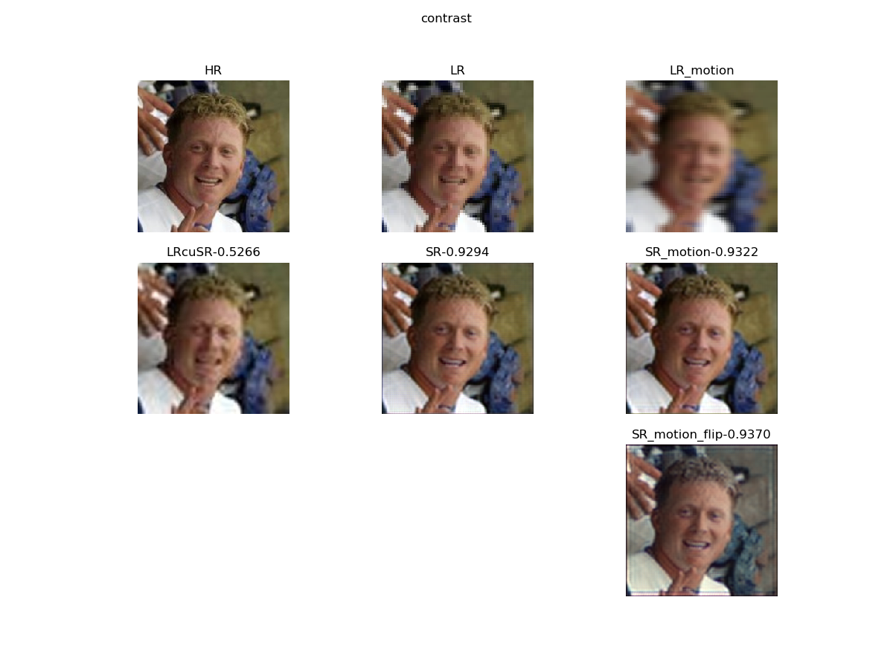

### 网络探索
- [Face and Image Super-resolution](https://github.com/jingyang2017/Face-and-Image-super-resolution)
	提供了测试代码，但似乎没有训练代码
	> 论文：Adrian Bulat*, Jing Yang*, Georgios Tzimiropoulos "To learn image super-resolution, use a GAN to learn how to do image degradation first" in ECCV2018
- [Super Resolution with CNNs and GANs](https://github.com/flymin/Super_Resolution_with_CNNs_and_GANs)
	一个课程仓库，包含多种SR在人脸领域的实现——CNN以及GAN方法都有，仓库中似乎包含了预训练的权重文件
- [WaveletSRNet](https://github.com/hhb072/WaveletSRNet)
	人脸超分辨的实现，代码中没有独立的测试脚本，训练过程中包含了测试
	> 论文： "Wavelet-srnet: A wavelet-based cnn for multi-scale face super resolution", ICCV 2017

### 评价函数
1. 从评价的代码中可以直接导出计算cos距离使用的512维向量并完成两张人脸图像的比较
2. 评价之前作者使用了从matlab移植过来的cp2tform函数，这个函数完成的功能是将人脸进行相关性匹配并裁剪到指定大小[参考](https://zhuanlan.zhihu.com/p/29515986)
即从 

 转换到 

 这样的操作使得从复杂图像中抽取人脸成为可能
	> 考虑到分辨率因素，因为人脸监测网络所需要的分辨率并不是很大，所以分辨率难点可以设置为：
	> 1. 使用很小的分辨率，因为是真严重因此复原难度较高
	> 2. 使用高分辨率图像但人脸区域小

### 实际代码
1. 仿射变换结果：250 x 250 x 3 -> 112 x 96 x 3  变换矩阵采用应该是人脸数据集的关键点标注（使得关键点位置固定）【猜测】 

 
	**所以我们是否需要关注特殊部分？**
2. 注意cv2使用的是BGR通道，常用的库使用的都是RGB通道
3. 测试代码给图像做了翻转，但是计算cos值得时候并没使用翻转结果
4. 这个代码速度很快，处理6000张从zip读取到最终输出结果只需要1min左右

### 目前测试结果
*	==> CX_78e4.csv <==
	mean,0.5274003478810191

*	==> ESR_BEST.csv <==
	mean,0.5094486193433404

*	==> ESR_BEST_x2.csv <==
	mean,0.5087806357145309

*	==> FACE_24e3.csv <==
	mean,0.5627119918465614

* 	==> Face_Blur_12e2.csv <==
	mean,0.5665142869949341

*	==> Face_Test_E29.csv <==
	mean,0.6200199598520995

*	==> LRcuSR.csv <==，直接使用立方插值放大四倍
	mean,0.6439442080557346
	目前来看给出的降采样方法不只是简单地cubic插值，如果直接使用cv2的cubic降采样-升采样，结果能够达到0.8333
*	==> SR_sub_56e4.csv <==
	mean,0.5148451432883739

*	==> WGAN_33e4.csv <==
	mean,0.5197292681634426

*	face_lfw_test
	- 只使用feature loss并采用单一lfw数据集会出现过拟合现象 
	- 只使用feature loss有很快的收敛效果（使用5e-4即可到达0.9+的水平），其他训练方法都是使用了很小的学习率才到达现在的水平（1e-5）,

| pixel | feature | cos 	| motion | flip 	| flip&motion |
|-------|---------|--------	|--------|------	|-------------|
| 10 	| 5 	  | 0.8961 	|	-	 |	-		|	-		|
| 5 	| 10 	  | 0.9107 	| 0.9089 | 0.9042 	| 0.9052 	|
| 5 	| 5 	  | 0.9018 	|	-	 |	-		|	-		|
| 1 	| 10 	  | 0.9037 	|	-	 |	-		|	-		|
| 0 	| 10 	  | 0.9195	| 	-	 | 	-		| 0.9133 	|
| 1		| 0		  |	-		| 0.8036 |	-		| -			|

*	RRDB-0.9079，看形势还能继续

### ATTENTION
1. down-sampling的代码对不同扩展名图片会有不同的表现，应该是最后保存图像的时候发生的不同，png类型图像质量会好很多，而jpg则很差
2. 只使用模糊数据集并没有更好的效果，而且加入模糊抖动也没有什么好的表现
3. 在CASIA上表现较好，在不同数据集下不太可能实现表现的统一 -> 考虑依照不同的数据集分别训练模型
4. **思考**：样本不均衡问题会不会是导致模型收敛方向不一致的关键？如果是的话考虑进行样本均衡化处理，依据人脸分类（种类或人）预处理数据

### 数据集
- lfw 
	包含5749个人的13233张图片，最多的一人有530张图片，最少一张
- celebA 
	包含10177个人的202599张照片，最多的一个人有35张照片，最少一张
- CASIA-WebFace 
	包含10575个人的494414张照片，最多的一个人有804张照片，最少两张

### 装机
1. 安装anaconda，没有问题
2. 检查cuda版本（module），使用cuda 9.0
3. 安装pytorch，opencv，tensorboardX
4. hdf5依赖：需要使用pip安装opencv和tensorboardX，lmdb等库，使用conda会报错
